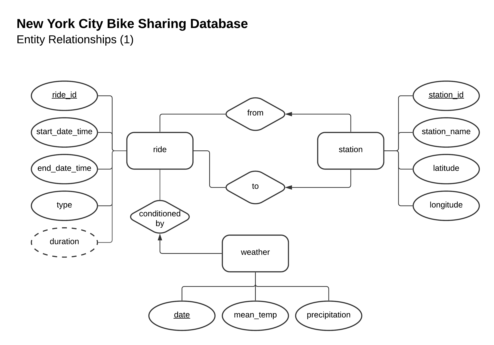
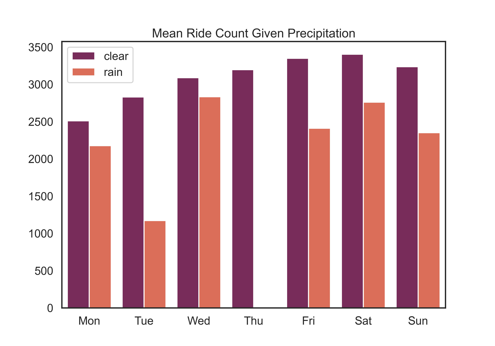

# New York City Bike Sharing—A Case Study

The goal of this project was to build a database using MySQL, query the database and gain insights from the data using visualizations and tables.

This project was a collaboration with [Clemens S. Heithecker](https://github.com/clemensheithecker) as part of group work in a Databases & Big Data course at Luiss Guido Carli University.

Riding a bike is a greener alternative to driving a car or taking a taxi and often is a quicker option for getting around traffic-jammed cities. Bike-sharing can be a useful service not only for tourists but also for commuters and locals. In this case study, we used bike-sharing data from Citi Bike in New York City and Newark as well as weather data to analyze riding patterns. For simplicity and to minimize the data size, we used data from October 2021.

## Implementation

We drew an entity-relationship diagram to guide the schema creation of our database.

    

    

    
</p

A summary of our analysis can be found in `presentation.pdf`.

## Instructions

Change the MySQL user credentials in the `config` dictionary in all Python scripts (`database-setup.py`, `analysis-stations.py`, and `analysis-rides.py`).

1. Run `database-setup.py` to setup the database with the schema defined in `database-setup.sql`, read the datasets, perform basic cleaning, and insert the data into the MySQL database.

    *NOTE: The database is overwritten every time the setup file runs. This is so changes can be made more conveninetly without manually deleting the database for every change in the setup. To prevent this, comment out `DROP DATABASE IF EXISTS nyc_bike_sharing;` in `database-setup.sql`.*

2. Run `analysis-stations.py` and `analysis-rides.py` to query the database using the respective SQL scripts (`analysis-stations.sql` and `analysis-rides.sql`). Both scripts each generate three visualizations in the `\figures` folder.

## Libraries Used

We used several Python libraries to create this project:

- [mysql.connector](https://dev.mysql.com/doc/connector-python/en/) to connect to the MySQL database server (localhost) in Python
- [pandas](https://pandas.pydata.org/) for basic data cleaning and transformation in Python
- [matplotlib.pyplot](https://matplotlib.org/) and [seaborn](https://seaborn.pydata.org/) for data visualization
- [GeoPandas](https://geopandas.org/en/stable/) to convert pandas DataFrames to geospatial data for map visualizations
- [contextily](https://pypi.org/project/contextily/) to get map tiles used for the background map in the map visualizations

We used Python 3.9 throughout the project.

## References

We used data from the following sources:

Menne, Matthew J., Imke Durre, Bryant Korzeniewski, Shelley McNeal, Kristy Thomas, Xungang Yin, Steven Anthony, Ron Ray, Russell S. Vose, Byron E.Gleason, and Tamara G. Houston (2012): Global Historical Climatology Network - Daily (GHCN-Daily), Version 3. NOAA National Climatic Data Center. doi:10.7289/V5D21VHZdoi:10.7289/V5D21VHZ. Retrieved November 23, 2021, from [https://www.ncdc.noaa.gov/cdo-web/datasets/GHCND/stations/GHCND:USW00094728/detail](https://www.ncdc.noaa.gov/cdo-web/datasets/GHCND/stations/GHCND:USW00094728/detail).

NYC Bike Share, LLC & Jersey City Bike Share, LLC. (2021, November 5). *JC-202110-citibike-tripdata* [Dataset]. [https://ride.citibikenyc.com/system-data](https://ride.citibikenyc.com/system-data)
